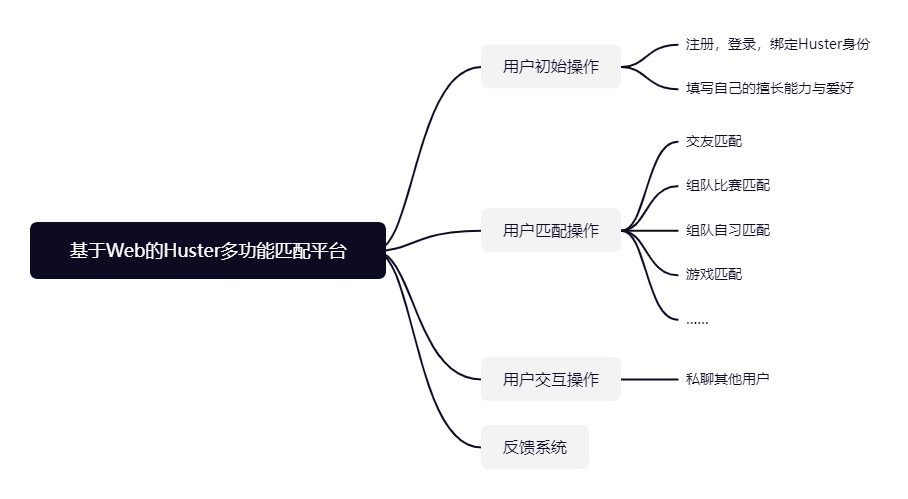

# 软件工程定项第一次会议记录
- **参会者**：匡智颉，崔泽涛，徐子路，李椿
- **时间**：2022年9月23日
## 项目选择
通过开会讨论，我们得出以下设计想法：
1. 将校园3D建模虚拟世界，每个人可以创建一个虚拟形象，在世界中可以创建私人小世界，只有相同爱好的人才能进入。
2. 记账app，可以调用微信/支付宝账单或校园卡流水，自动对支出和收入进行记账。
3. 记笔记插件，阅读文本的同时可以快捷记录笔记，支持Markdown，可以输出为pdf。
4. 华科供需平台，划分可以平台上发布有偿/无偿需求，也可以接需求，采用校园卡绑定身份，可以出书/组队学习/组队比赛。
5. 华科探食堂平台，将华科内食堂的各个餐品上传照片，可以进行投票评价选出最美味的餐品和防踩雷的餐品。
6. 多功能匹配app，根据自己的需求，自动匹配具有相同需求和喜好的多个人，可以进行交友匹配、组队出游匹配、组队项目以及比赛匹配、游戏匹配等等。

**项目的最终选择为6. 基于Web的Huster多功能匹配系统（Web、App或者小程序实现）** 
****

### 1. 主要技术栈
**前端**：Html、CSS、JavaScript 
**后端**：C++/Java 

### 2. 团队分工
**前端开发**：暂定 
**后端开发**：暂定 
**接口对接**：暂定 

## 项目分析（头脑风暴）
### 1. 现有选课（题）系统的不足
>* 现有市面上还没有较好的同类型的匹配系统。
>* 没有良好的渠道寻找与自己相同爱好的Huster朋友。
>* 需要参加组队比赛或者任务时，大家很难在短时间内找到合适的队友。
>* 在玩游戏时，找不到给力的Huster队友或者同学一起游玩。
>* 现有交友平台容易鱼龙混杂，缺乏安全保证。

### 2. 改进方式
- [x] 搭建Huster多功能匹配平台。

- [x] 增加Huster交友匹配、组队匹配以及游戏匹配功能。

- [x] 增加身份验证系统。

- [x] 增加私聊系统。

- [x] 增加反馈系统。

### 3. 题目来源
* 分析Huster们与自身对交友、组队比赛、组队自习、游戏的需求情况。

### 4. 需求
* 注册

* 登陆

* 身份验证
  
* 用户信息登记
  
* 用户需求和用户爱好登记

* 交友匹配

* 组队比赛匹配

* 组队自习匹配

* 游戏匹配

## 思维导图

